# Homework 1

## Chongyi Xu, AMATH 342, Win2018

1. **MATLAB Tutorial**

* If Statement Exercise 4.1
    
    For this question, I defined the ```signal_vector``` to be $sin(t)$ and the ```threshold``` to be at $1.9$. In order to calculate the cumulative sum of the signal crosses the threshold, I use a outer ```for loop``` and a inside ```if statement```. For the sum up to current $t$, if the sum crosses the ```threshold```, print $t$ and break the ```for loop```.

    ```Matlab
    sum = 0;
    thresh = 1.9;
    for t=1:10
        sum = sum + sin(t);
        if (sum >= thresh)
            t
            break;
        end
    end
    ```
* For Loops Exercise 3.2
    
    For this exercise, the question gives the instance that for each neuron that is firing "on", there will be two more to be switched "on" for every second. For simple calculation, it just means that for every second, there will be $3$ times of cells to be switched on according to the current number of "on" neurons. And then we can start with our code.

    ```Matlab
    number_on = 1;
    for t=2:30
        number_on(t) = 3 * number_on(t - 1);
    end

    figure
    plot(number_on)
    title('Number of "on" neurons over time')
    xlabel('time t')
    ylabel('Number of "on" neurons')
    ```

    Output Image: 
    
    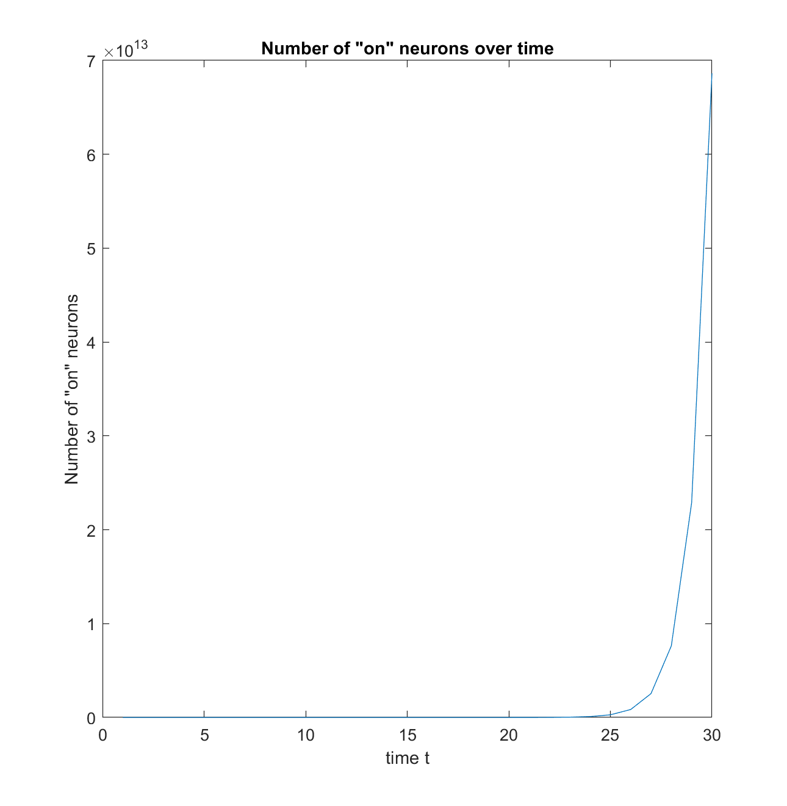


* Function Exercise 5.1
    
    This is a simple question. Just simple function setup. And since $S$ and $Z$ are both matrix, the multiple sign must be ```.*```
    
    ```Matlab
    function B = rmatrix(A, S, Z)
        B = A + S .* Z;
    return
    ```

2. **Spike Train Analysis and Tuning Curves**

    1. Look at the first cell response and get a number of reptition for a direction of stimuli with 45 degrees.
    
    ```Matlab
    spiketrain = generate_noisy_data_cockroach(45, 1, 5);
    ```
    
    In order to generate spiking responses based on degree, cell number and number of trails, I modified the given code to a function.

    ```Matlab
    % 
    % This code will generate a spiking response to an input based on a tuning
    % curve and assuming (inhomogeneous) Poisson firing. The response adapts
    % over time, with a time constant of tau
    %
    function spiketrain = generate_noisy_data_cockroach(stimDir, cell_num, ntrials)

        rand('state',sum(100*clock));
        
        %{
        stimDir = input('Input the direction of your stimulus in degrees ');
        cell_num = input('Which cell do you want to record from (1,2,3) ');
        ntrials = input('How many repeated trials would you like to perform? ');
        %}

        nmsec = 300;    % number of milliseconds to record for
        times= 1:nmsec; % vector of time points (1 msec apart)

        spiketrain = zeros(ntrials,nmsec);      % set up output data

        rate = cockroach_tuning(stimDir, cell_num); %returns rate, in Hz.       
        tau = 100;      % adaptation time constant in msec
        delta_t=0.001; %time bin, in seconds (1 msec)
        ratefun = rate*exp(-times/tau);  % adapting rate function 


        for j = 1:ntrials;

            for i = 1:nmsec;

                    spiketrain(j,i) = round(rand + ratefun(i)*delta_t -1/2 );

            end;
        end;
    end
    ```

    Use **MATLAB** plotting to see the response of each cell ($[1, 2, 3]$) for stimuli direction of $[0, 30, 45, 60, 90]$. I picked $10$ trials for each run since within $10$ trials, we could get a relatively meaningful data and also a readable plot.
    
    In order to compute the average firing rate and the standard deviation, I wrote a function script.
    
    ```Matlab
    function rate = count_rate(degree, cell, trial)
        spiketrain = generate_noisy_data_cockroach(degree, cell, trial);
        figure;
        imagesc(spiketrain)
        xlabel('Time t');
        ylabel('Trails');
        set(gca, 'YTick', 1:trial);
        sums = zeros(1, trial);
        for k = 1:trial
            sums(k) = sum(spiketrain(k, :));
        end
        rate = mean(sums) / 300;
        fprintf('For direction of %d, cell %d within %d trails has a sum of %d and a standard-deviation of %d. \n', degree, cell, trial, mean(sums), std(sums));
    end
    ```
    And then we can look at every cases
    
    * *Cell 1 at 0 $\degree$*

    ```Matlab
    rate_0_1_10 = count_rate(0, 1, 10);
    ```
    Output:
    ```
    For direction of 0, cell 1 within 10 trails has an average firing rate of 0 and a standard-deviation of 0. 
    ```

    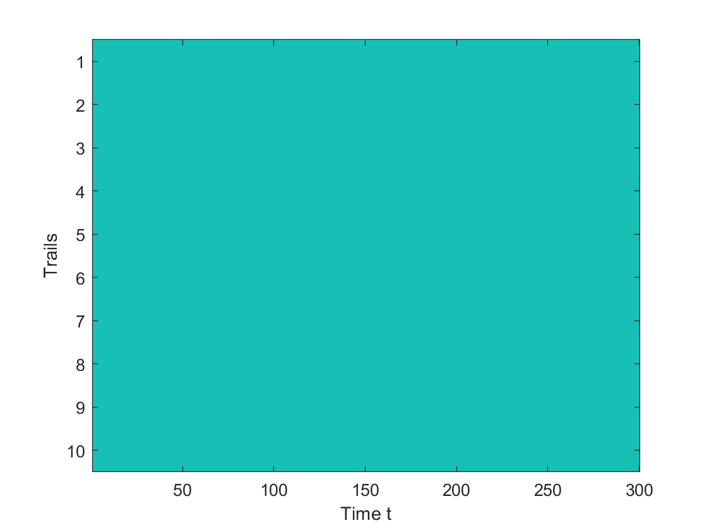

    * *Cell 2 at 0 $\degree$*
    ```Matlab
    rate_0_2_10 = count_rate(0, 2, 10);
    ```
    Output:
    ```
    For direction of 0, cell 2 within 10 trails has an average firing rate of 0 and a standard-deviation of 0. 
    ```

    

    * *Cell 3 at 0 $\degree$*
    ```Matlab
    rate_0_3_10 = count_rate(0, 3, 10);
    ```
    Output:
    ```
    For direction of 0, cell 3 within 10 trails has an average firing rate of 1.333333e-03 and a standard-deviation of 5.163978e-01.
    ```

    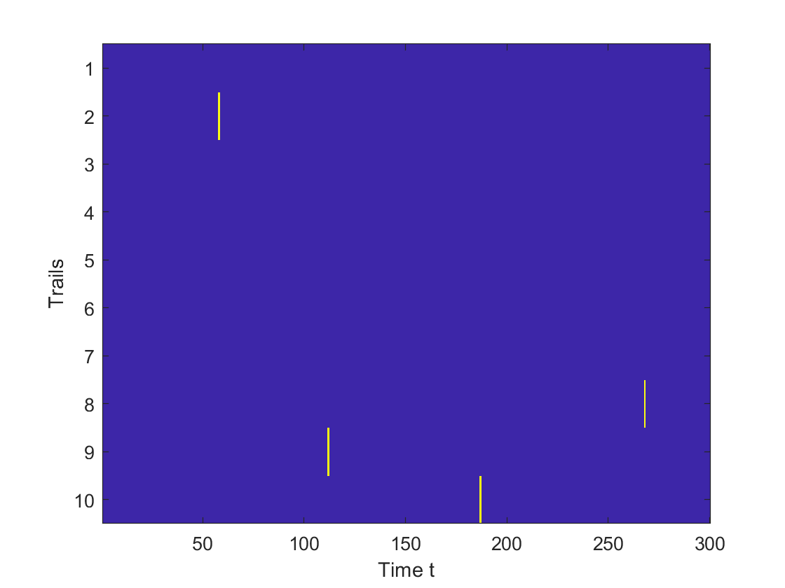

    * *Cell 1 at 30 $\degree$*
    ```Matlab
    rate_30_1_10 = count_rate(30, 1, 10);
    ```
    Output:
    ```
    For direction of 30, cell 1 within 10 trails has an average firing rate of 2.000000e-03 and a standard-deviation of 8.432740e-01.
    ```

    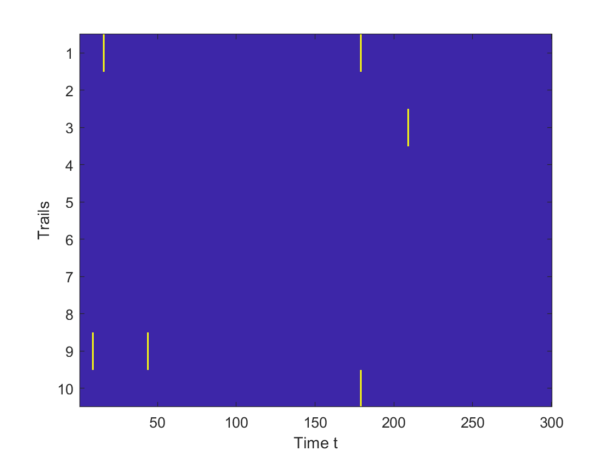

    * *Cell 2 at 30 $\degree$*
     ```Matlab
    rate_30_2_10 = count_rate(30, 2, 10);
    ```
    Output:
    ```
    For direction of 30, cell 2 within 10 trails has an average firing rate of 3.166667e-02 and a standard-deviation of 1.900292e+00.
    ```

    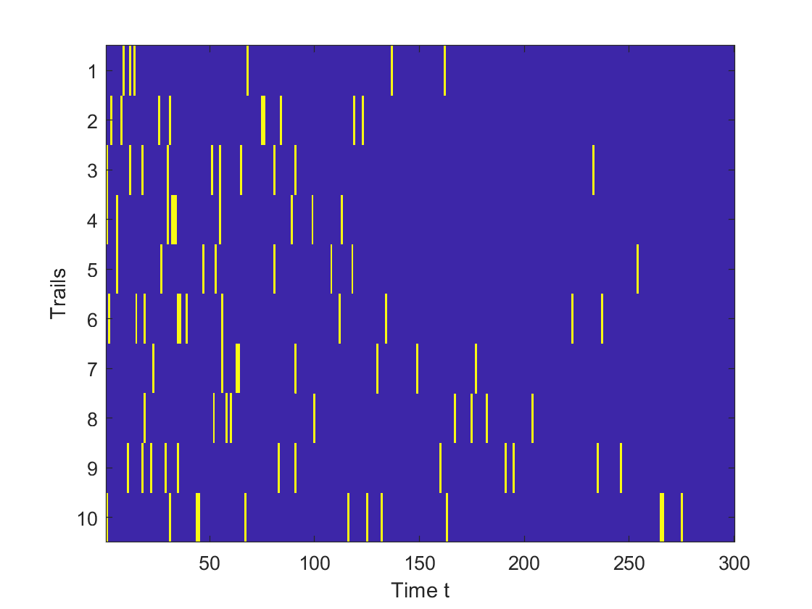

    * *Cell 3 at 30 $\degree$*
     ```Matlab
    rate_30_3_10 = count_rate(30, 3, 10);
    ```
    Output:
    ```
    For direction of 30, cell 3 within 10 trails has an average firing rate of 8.700000e-02 and a standard-deviation of 3.842742e+00.
    ```

    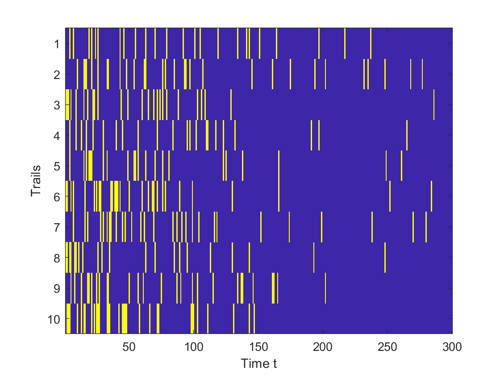

    * *Cell 1 at 45 $\degree$*
     ```Matlab
    rate_45_1_10 = count_rate(45, 1, 10);
    ```
    Output:
    ```
    For direction of 45, cell 1 within 10 trails has an average firing rate of 9.933333e-02 and a standard-deviation of 4.962078e+00.
    ```

    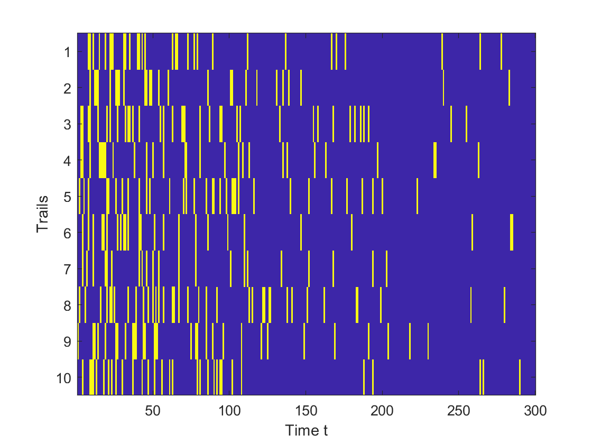

    * *Cell 2 at 45 $\degree$*
     ```Matlab
    rate_45_2_10 = count_rate(45, 2, 10);
    ```
    Output:
    ```
    For direction of 45, cell 2 within 10 trails has an average firing rate of 9.233333e-02 and a standard-deviation of 4.808557e+00.
    ```

    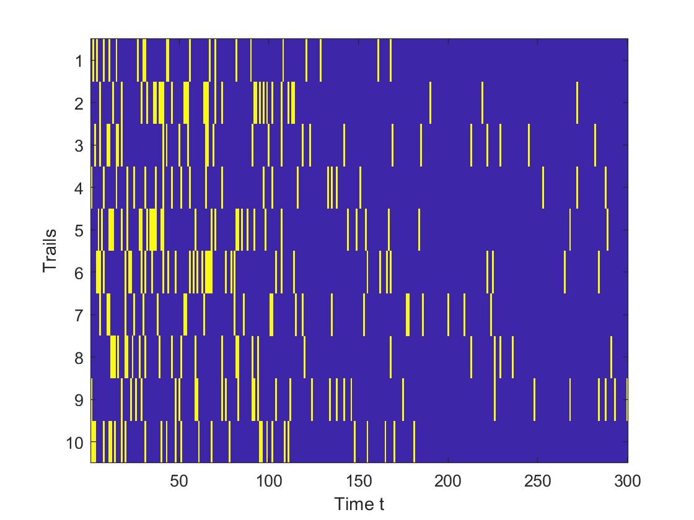

    * *Cell 3 at 45 $\degree$*
     ```Matlab
    rate_45_3_10 = count_rate(45, 3, 10);
    ```
    Output:
    ```
    For direction of 45, cell 3 within 10 trails has an average firing rate of 6.233333e-02 and a standard-deviation of 4.571652e+00.
    ```

    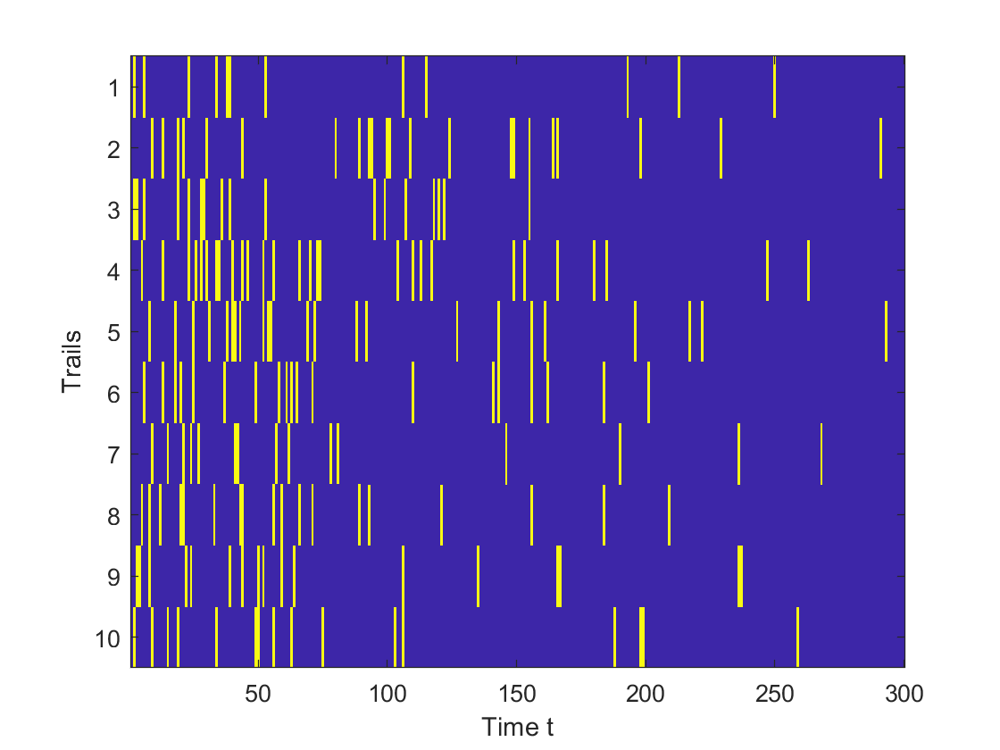

    * *Cell 1 at 60 $\degree$*
     ```Matlab
    rate_60_1_10 = count_rate(60, 1, 10);
    ```
    Output:
    ```
    For direction of 60, cell 1 within 10 trails has an average firing rate of 6.666667e-04 and a standard-deviation of 4.216370e-01.
    ```

    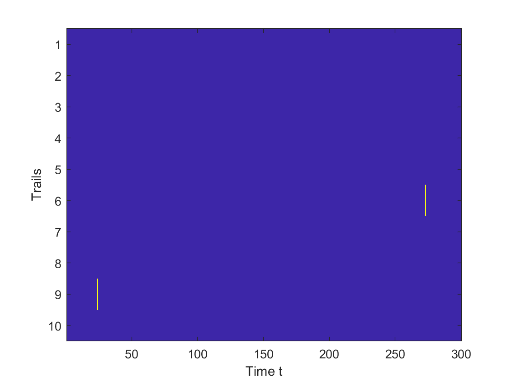

    * *Cell 2 at 60 $\degree$*
     ```Matlab
    rate_60_2_10 = count_rate(60, 2, 10);
    ```
    Output:
    ```
    For direction of 60, cell 2 within 10 trails has an average firing rate of 2.633333e-02 and a standard-deviation of 3.414023e+00.
    ```

    

    * *Cell 3 at 60 $\degree$*
     ```Matlab
    rate_60_3_10 = count_rate(60, 3, 10);
    ```
    Output:
    ```
    For direction of 60, cell 3 within 10 trails has an average firing rate of 9.800000e-02 and a standard-deviation of 7.198765e+00.
    ```

    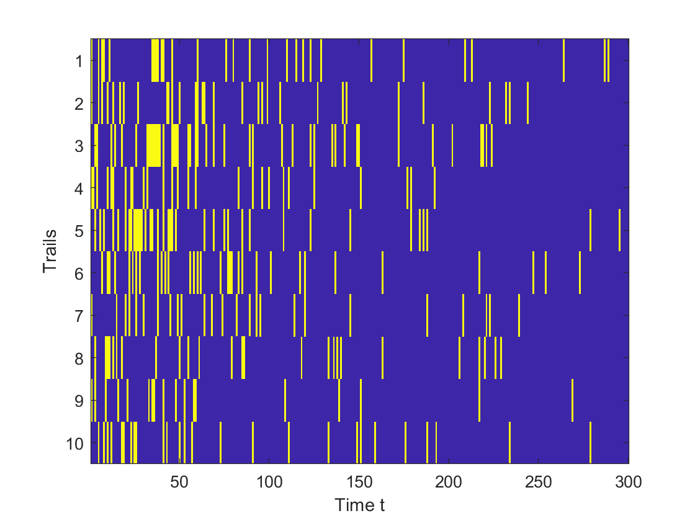

    * *Cell 1 at 90 $\degree$*
     ```Matlab
    rate_90_1_10 = count_rate(90, 1, 10);
    ```
    Output:
    ```
    For direction of 90, cell 1 within 10 trails has an average firing rate of 0 and a standard-deviation of 0.
    ```

    

    * *Cell 2 at 90 $\degree$*
     ```Matlab
    rate_90_2_10 = count_rate(90, 2, 10);
    ```
    Output:
    ```
    For direction of 90, cell 2 within 10 trails has an average firing rate of 0 and a standard-deviation of 0.
    ```

    

    * *Cell 3 at 90 $\degree$*
     ```Matlab
    rate_90_3_10 = count_rate(90, 3, 10);
    ```
    Output:
    ```
    For direction of 90, cell 3 within 10 trails has an average firing rate of 1.000000e-03 and a standard-deviation of 4.830459e-01. 

    ```

    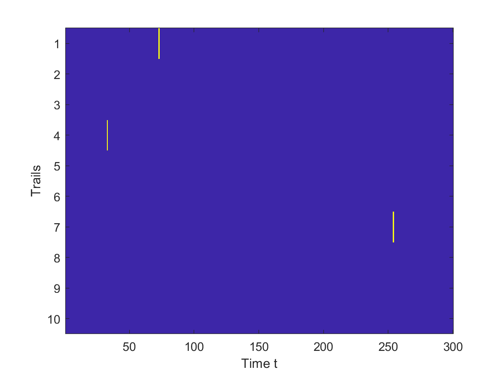

    2. Examine the time course of the plots.
    
        From the plots, we can see that the firing rates appear to be varying over the trials. For instance, for the case cell 3 at 60 $\degree$
        
        
        
        We can see that the spikes mostly fire within first $150$ ms but not so often within the rest of time. I generate another plot to see how it changes.

        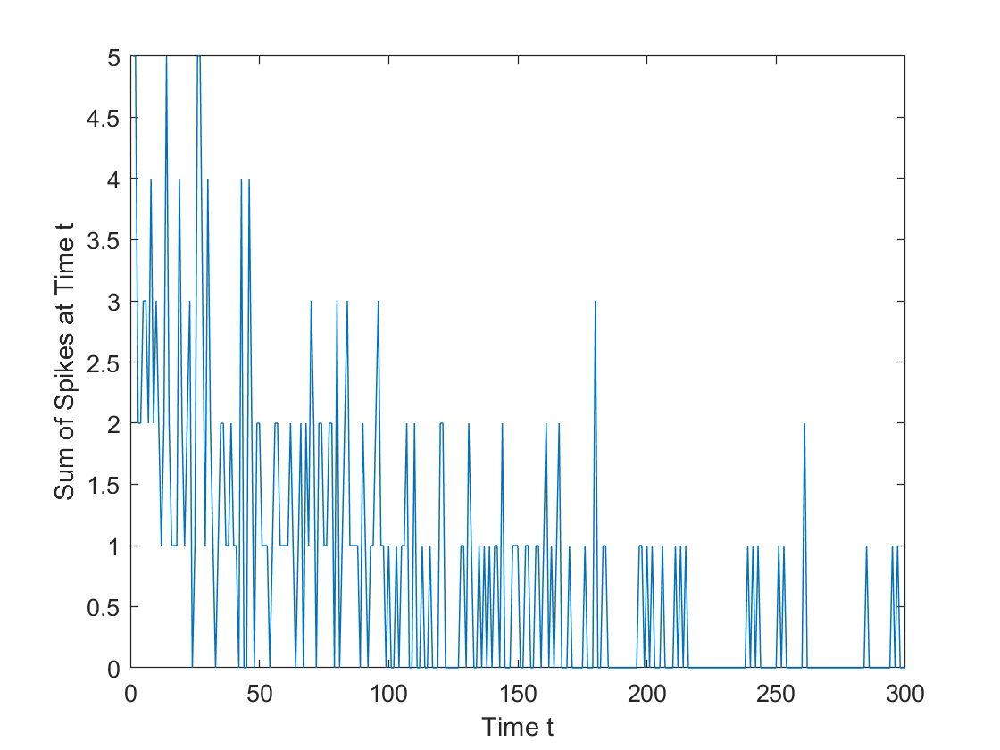

        From this graph, it is easy to see that the spikes firing rate is decreasing over time.

    3. How the cell's responses change as a function of stimulus parameters we've chosen

        I modified my function
    
    ```Matlab
    function [rate, sd] = count_rate(degree, cell, trial)
        spiketrain = generate_noisy_data_cockroach(degree, cell, trial);
        sums = zeros(1, trial);
        for k = 1:trial
            sums(k) = sum(spiketrain(k, :));
        end
        rate = mean(sums) / 300;
        sd = std(sums);
    end
    ```
    
    And then I use the given ```cockroach_tuning.m``` to generate the $f$ and make plots for each cell
    
    ```Matlab
    tuning(1);
    tuning(2);
    tuning(3);
    function sd = tuning(cell)
        f = cockroach_tuning(1:90, cell);
        a = zeros(1, 90);
        sd = zeros(1, 90);
        for d = 1:90
            [a(d), sd(d)] = count_rate(d, cell, 100);
        end
        figure
        plot(f)
        errorbar(f, sd);
        ylabel('f(Hz)');
        xlabel('Direction');
    end
    ```
    And the plot I got are the following

    * Cell 1
    
    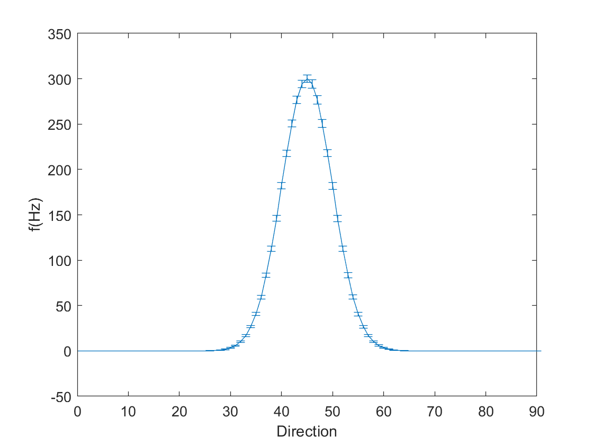

    * Cell 2

    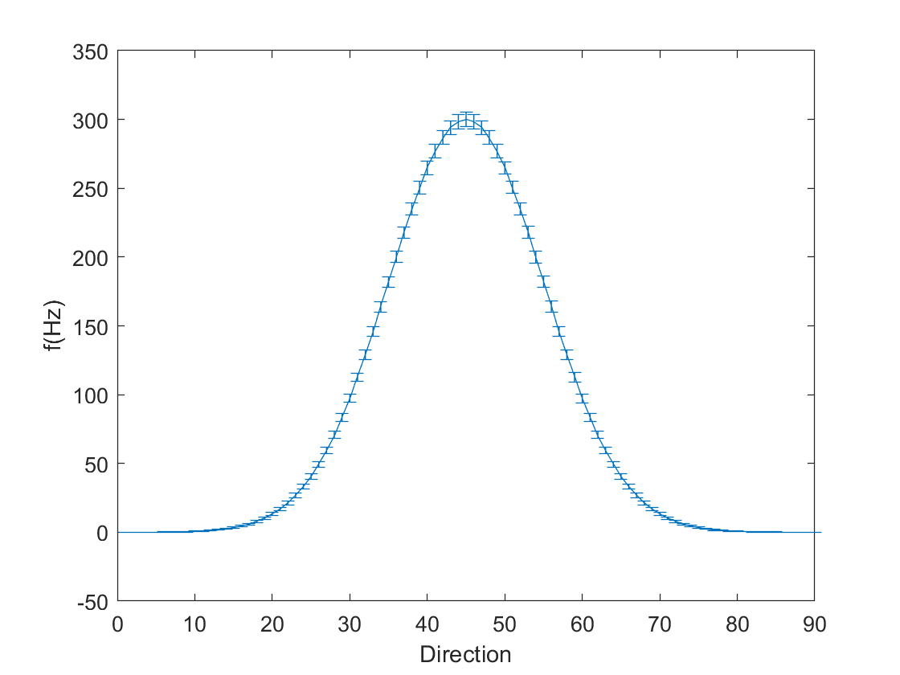

    * Cell 3

    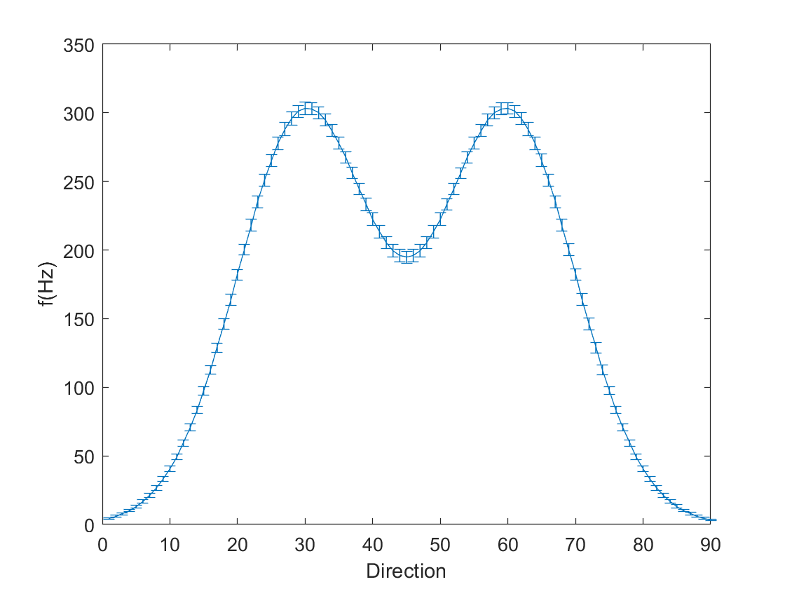

    From the plots we can conclude that for the first two cells, the peak of firing rate are both at around $45\degree$. And decreasing the firing rate with increasing or decreasing the direction. However, for the third cell, the peak of the firing rate is at $30\degree$ and $60\degree$ and decreases the firing rate as the direction approches to $45\degree$ and $0\degree$ ($90\degree$).