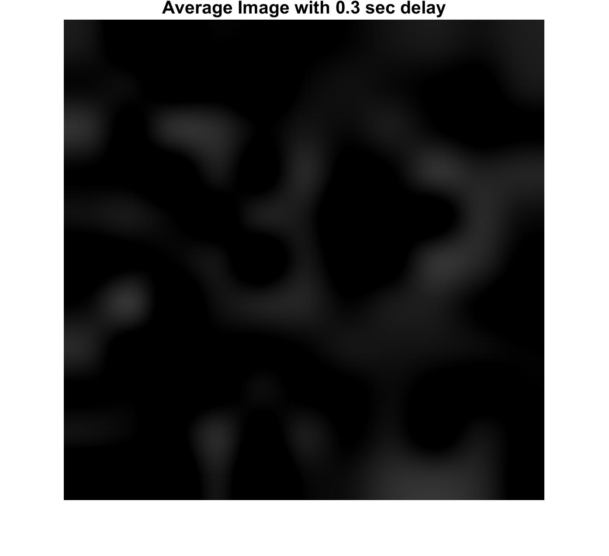
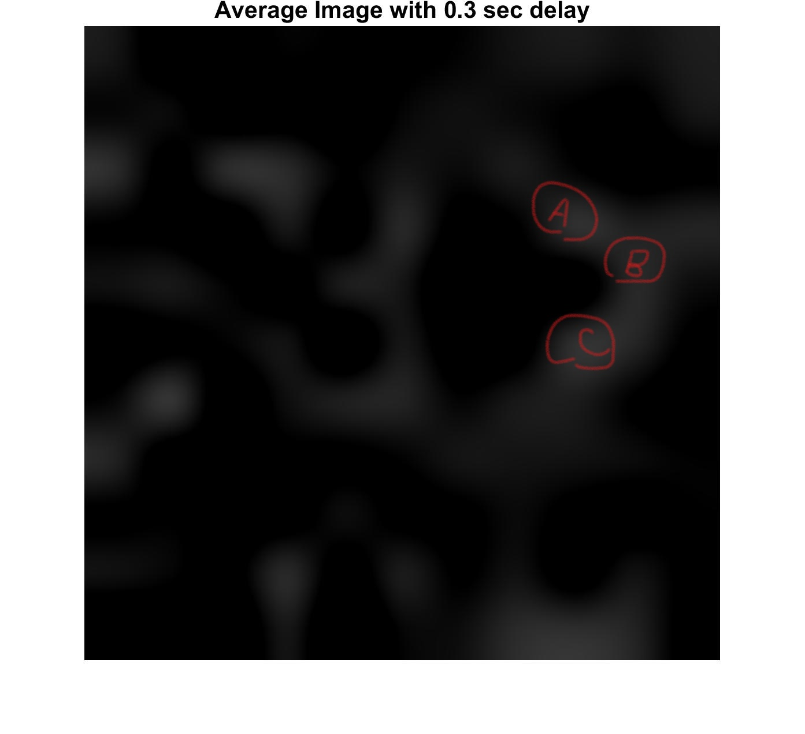
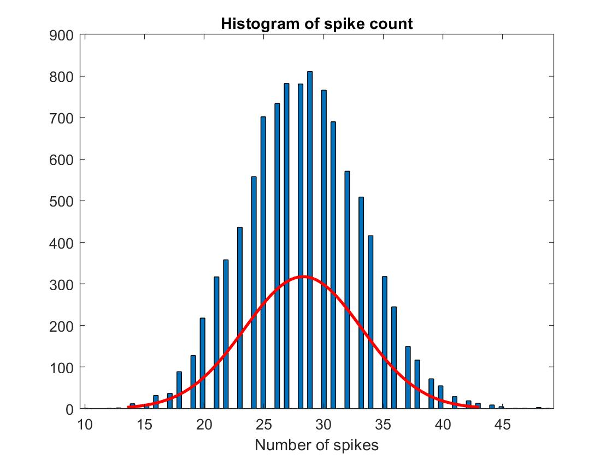
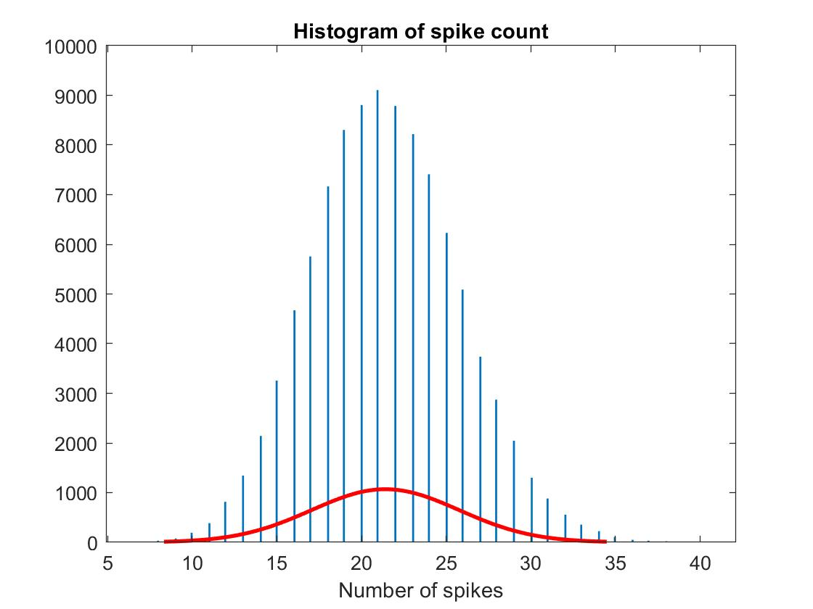

# AMATH 342 HW 2
## Due Monday, Feb 12
### Chongyi Xu, Univeristy of Washington

## PART 1
1. Plot average image and describe.

    The first step is to generate spike train and stimuli with white noise experiment.

``` 
>> v1_white_noise_exp
How many seconds to run the white noise experiment? 
  Enter a number, at least 10: 1000
```

Generally, with 1000 seconds noise experiment, it could have a convincing result.

And then I tried to get a reasonable delay between the image and the spike to get a relatively clear image for the average image. After several tries, I decided to take $delay=0.3$ since it produces the clearest image I could get.

```Matlab
delay = 0.3;
i = find(spikeTrain == 1);
ii = i + round(time_between_samples * delay);
[m, n, L] = size(stim);
img = zeros(length(ii), m * n);
for k = 1:length(ii)
    if k > L
        img(k, :) = reshape(stim(:, :, L), m * n, 1);
    else
        img(k, :) = reshape(stim(:, :, k), m * n, 1);
    end
end
ave = mean(img);
ave = reshape(ave, m, n);
ave = imresize(ave, 100);
figure(1);
imshow(ave);
title('Average Image with 0.3 sec delay');
set(gca,'Fontsize',14,'fontweight','bold');
```

And the average image I found is



From the image, we could say that this certain neuron prefers two pixels at top left and two pixels at bottom left. Also several pixels in the middle and right that are connected with others. The features I could considere about is circles in the middle since the connections of the averaged pixels are forming a shape in the middle side.

2. Decribe in three sentences or so a hypothetical neuron for which this average would be misleading, and why.

Since from the previous procesees, we only got an averaged image from $1000 * 60 = 60000$ frames, which is relativly a large number but not enough. We need much more information (or say, pixels and frames) to decide the feature of image but not only with these number of frames. I concluded that the neuron might respond to circle features in the middle in the previous problem. However, it could not misleading since it could be the feature only due to averaged images but not orignal images. The certain neuron might fire spikes when it receives pixel at A, B, C but if images are averaged, it might be misleading that they formed a circle.



## PART 2
1. Take one of your inputs to be 50 ($stimuli = 50$), and study cell number 1. Explore how discrinable responses to stimuli close to 50 are, given the spiking output.

First of all, construct a function to compute the spike count.

```Matlab
function c = count_spike(spiketrain)
    c = length(find(spiketrain == 1));
end
```

Then generate the spike train using ```generate_noisy_data_cockroach.m```

```
>> generate_noisy_data_cockroach
Input the direction of your stimulus in degrees 45
Which cell do you want to record from (1,2,3) 1
How many repeated trials would you like to perform? 100000
```

Then,construct a vector that stores all spike counts from every trail.

```Matlab
trails = 100000;
sum = zeros(trails, 1);
for k = 1:trails
    sum(k) = count_spike(spiketrain(k, :));
end
```

And then we would like to know about the distribution of the data. Simply have a histogram with normal distribution plot for the spike train.

```Matlab
%% Plot the spikes
histfit(sum);
title('Histogram of spike count');
xlabel('Number of spikes');
```

Then we can see from the figure



It can be seen that the distribution is varied around 25 ~ 30. To be more specific, we find its mean and variance.

```Matlab
>> mean(sum)

ans =

   28.2994

>> var(sum)

ans =

   24.1250
```

We can see that it has a high variance which might be not so good for analyzing.

(a) What is the resulting error probability? 

To find the error probability, we just need to find the percentage of response to stimulus $input = 50$ and a stimulus close to 50 ($|Count_{spike} - input| <= x$), $x = 1, 2, 3...$

```Matlab
input = 50;
x = 1;
% error probability
err = 1 - length(find(abs(sum - input) <= x)) / ntrials;
```

And the error percentage I got is

```
>> err

err =

    0.9999
```

which is about to $1$. So it means that for cell number 1 at $45\degree$, there is $99.99\%$ probability that the stimulus respond to $50$ or close to $50$.

(b) How much higher or lower does the closeby stimulus need to be to get an error probability of $10\%$?

Take the tolerence to be $0.1$. Find the corresponding $x$ value such that $P(|Count_{spike} - input| <= x) <= 10\%$.

```Matlab
%% tol
tol = 0.1;
while err > tol
    x = x + 1;
    err = 1 - length(find(abs(sum - input) <= x)) / ntrials;
end
```

The $x$ value I found is 

```
>> x

x =

    28
```

So the closeby stimulus need to get 28 higher to get an error probability of $10\%$.

(c) How does that compare with the case when the "starting" input is 20 rather than 50.

Starting with $x = 20$, the error probability is much lower than the starting point with $50$.

```Matlab
input = 20;
x = 1;
% error probability
err = 1 - length(find(abs(sum - input) <= x)) / ntrials;
```

The error probability I got is

```
>> err

err =

    0.9421
```

With same process, I got the result $x$ to be

```Matlab
>> x

x =

    15
```

So the closeby stimulus need to get 15s more to get an error probability of $10\%$ with a starting point at $20$.

2. Can you change the tuning curve for cell number 1 so that the neural system gives a more discriminable response near the input value 20?

In order to make the response more discriminable near the input value 20, I modified the ```cockroach_tuning.m``` for cell number 1

```Matlab
if cell_num == 1
    mu = 60;
    sigma = 20;
    f = gaussian(mu, sigma, stim_dir);
```

And with this pair of $\sigma$ and $\mu$ value, I got the histogram like the following



This spike train gives a distribution that has 

```
>> mean(sum)

ans =

   21.4050
```

which could give a error percentage of

```
>> err

err =

    0.7379
```

And the corresponding $x$ I found is

```
>> x

x =

     7
```

## Appendix

``` Matlab
%% Find the image matrix
delay = 1;
i = find(spikeTrain == 1);
ii = i + round(time_between_samples * delay);
[m, n, L] = size(stim);
img = zeros(length(ii), m * n);
for k = 1:length(ii)
    if k > L
        img(k, :) = reshape(stim(:, :, L), m * n, 1);
    else
        img(k, :) = reshape(stim(:, :, k), m * n, 1);
    end
end
ave = mean(img);
ave = reshape(ave, m, n);
ave = imresize(ave, 100);
figure(1);
imshow(ave);
title('Average Image with 0.3 sec delay');
set(gca,'Fontsize',14,'fontweight','bold');

%% generate noisy data cockroach
ntrials = 100000;
spiketrain = generate_noisy_data_cockroach(45, 1, 100000);
%%
sum = zeros(ntrials, 1);
for k = 1:ntrials
    sum(k) = count_spike(spiketrain(k, :));
end
max(sum);
mean(sum);
%% Plot the spikes
histfit(sum);
title('Histogram of spike count');
xlabel('Number of spikes');
%%
input = 20;
x = 1;
% error probability
err = 1 - length(find(abs(sum - input) <= x)) / ntrials;

%% tol
tol = 0.1;
while err > tol
    x = x + 1;
    err = 1 - length(find(abs(sum - input) <= x)) / ntrials;
end


function c = count_spike(spiketrain)
    c = length(find(spiketrain == 1));
end
```