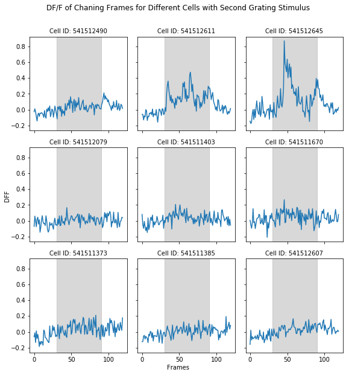
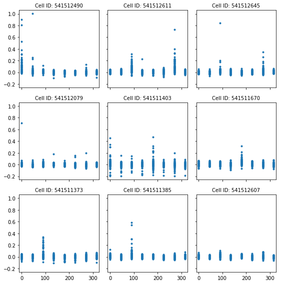
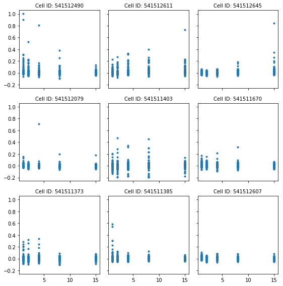
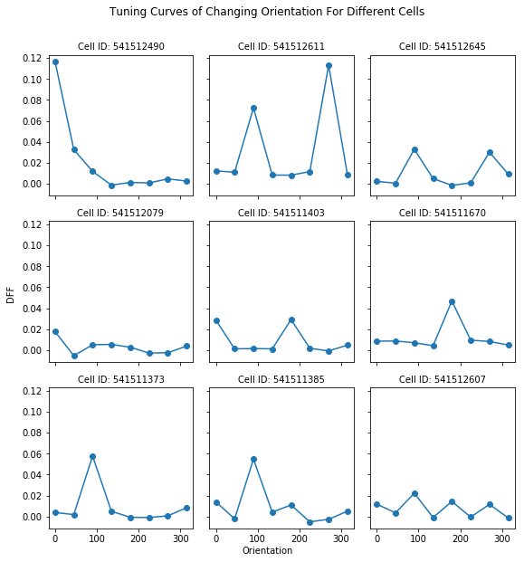
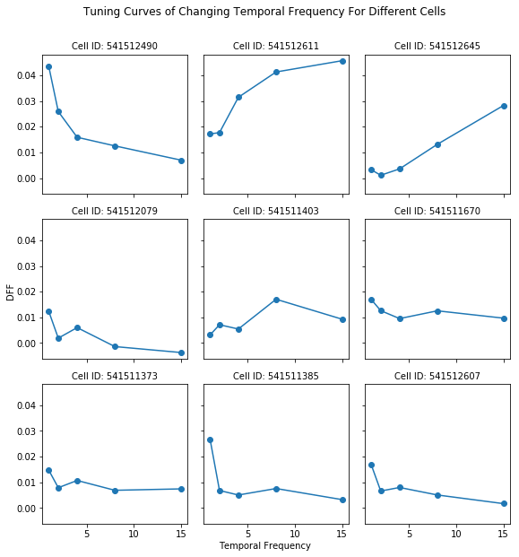
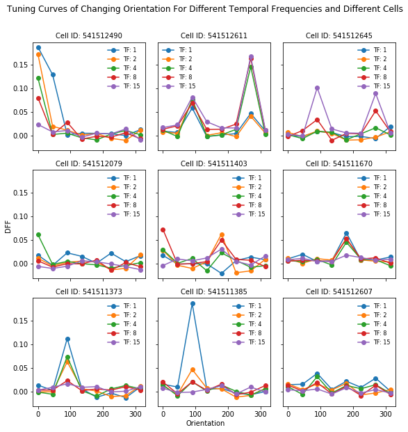
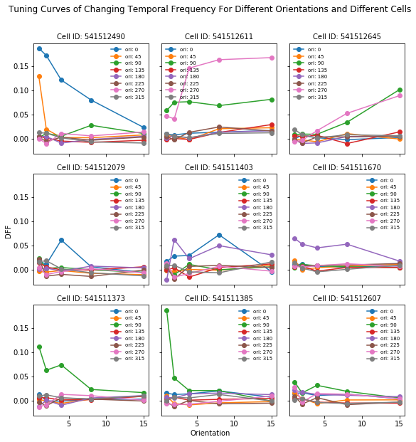
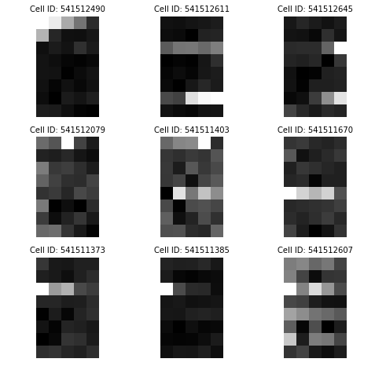

## AMATH 342 HW 5

### Chongyi Xu, 1531273, chongyix@uw.edu

## 1. Overview

For this homework, I will basically have a try on using [Allen Brain Observatory data](http://observatory.brain-map.org/visualcoding) to compute for several tuning curves for the given cell ids. And also, I will have a general comparison between those different cells to get a brief idea of their similarities and dissimilarities. The cell ids I will use are 541512490, 541512611, 541512645, 541512079, 541511403, 541511670, 541511373, 541511385, 541512607. 

<div style="background: #FFF0F0; border-radius: 3px; padding: 10px;">
<p>
Compute the tuning curves for cell_ids 541512490, 541512611, 541512645, 541512079, 541511403, 541511670, 541511373, 541511385, 541512607. (Hint: it might be helpful to write a function) In what ways do these tuning curves differ? In what ways are they the same? What are interesting parameters of a cell's response to this stimulus? </div>


## 2. Development and Results

### a. Import Data and Basic Setup

The first step, as usual, I imported some python packages that will be used in the following procedures.


```python
import numpy as np
import pandas as pd
import matplotlib.pyplot as plt
%matplotlib inline  
import sys, os
```

* `Numpy` provides array and matrix features for me that helps to store the needed values. 
* `Pandas` provides **DataFrame** that will be frequently used in accessing *Allen Brain Observatory Data*. 
* `Matplotlib` helps to make figures similar to the plot feature in  **MATLAB**. The `%matplotlib inline` enables jupyter notebook to directly generate matplot figure inline.

The next step is to set up the *Brain Observatory* as in the class notes.

**Notes:** The Brain Observatory Cache seems not working for `Python 3`. Use `Python 2` instead.


```python
from allensdk.core.brain_observatory_cache import BrainObservatoryCache

#Set manifest path when outside of AWS

drive_path = '/data/dynamic-brain-workshop/brain_observatory_cache/'
manifest_file = os.path.join(drive_path,'brain_observatory_manifest.json')

boc = BrainObservatoryCache(manifest_file=manifest_file)
```

For convinience, I will use the same function as in the class notes.


```python
def get_dff_traces_and_stim_table(cell_specimen_id, stimulus): 
    exps = boc.get_ophys_experiments(cell_specimen_ids=[cell_specimen_id], stimuli=[stimulus])
    session_id = exps[0]['id']
    print "Opening NWB file for ophys session. This will take several minutes if the file isn't downloaded yet."
    data_set = boc.get_ophys_experiment_data(session_id)
    print "All Done"
    timestamps, dff = data_set.get_dff_traces(cell_specimen_ids=[cell_specimen_id])
    dff_trace = dff[0,:]
    stim_table = data_set.get_stimulus_table(stimulus)
    return (timestamps, dff_trace, stim_table)
```

**Class Notes:**

I've created a function here that will return the DF/F trace and the stimulus table if we provide a cell id and a stimulus name. This function leverages functions in the AllenSDK, and there are examples that walk through these steps in other notebooks on the SDK page. I'm happy to explain the steps in greater detail if anyone is interested.  

The key things to know about this.  You provide the function with a cell_specimen_id and a stimulus name.  It returns:
+ the timestamps for the DF/F trace.  This is a numpy array.
+ the trace of that cell's DF/F trace for the whole session.  This is also a numpy array.
+ a table that describes the stimulus conditions and timing.  This is a <b>pandas</b> dataframe.

This function can take some time if this is the first time using a specific NWB file, so wait for it to print out "All Done"


Then, I create a data vector to store all cell ids I am going to acess. Since for all cells, the returned `timestamps` and `stim_table` will be the same, I will only store the cell's DF/F trace for time and memory efficient.


```python
cell_ids = [541512490, 541512611, 541512645, 541512079, 541511403, 541511670, 541511373, 541511385, 541512607]
dffs= np.empty([len(cell_ids), 115741]) # Every cell has a dff_trace with length of 115741. So dffs is a N_cells * 115741 matrix
for i, cell_id in enumerate(cell_ids):
    timestamps, dff_traces, stim_table = get_dff_traces_and_stim_table(cell_id, 'drifting_gratings')
    dffs[i, :] = dff_traces
```

    Opening NWB file for ophys session. This will take several minutes if the file isn't downloaded yet.
    All Done
    Opening NWB file for ophys session. This will take several minutes if the file isn't downloaded yet.
    All Done
    Opening NWB file for ophys session. This will take several minutes if the file isn't downloaded yet.
    All Done
    Opening NWB file for ophys session. This will take several minutes if the file isn't downloaded yet.
    All Done
    Opening NWB file for ophys session. This will take several minutes if the file isn't downloaded yet.
    All Done
    Opening NWB file for ophys session. This will take several minutes if the file isn't downloaded yet.
    All Done
    Opening NWB file for ophys session. This will take several minutes if the file isn't downloaded yet.
    All Done
    Opening NWB file for ophys session. This will take several minutes if the file isn't downloaded yet.
    All Done
    Opening NWB file for ophys session. This will take several minutes if the file isn't downloaded yet.
    All Done


**Note: Since we are going to access 9 different celss, the opening NWB file process will cost sometime**

### b. DF/F Response vs. Time Frame

After getting our DF/F traces for all cells, we would first like to see how the cells response to the given grating presentation.


```python
fig, axes2d = plt.subplots(nrows=3, ncols=3, sharex=True, sharey=True, figsize=(8,8))
for i, row in enumerate(axes2d):
    for j, cell in enumerate(row):
        trace = dffs[3*i+j, :];
        cell.plot(trace[stim_table.start[0]-30:stim_table.end[0]+30])
        cell.axvspan(30, 90, color='gray', alpha=0.3)
        cell.set_title("Cell ID: {0:d}".format(cell_ids[3*i+j]), fontsize=10)
plt.suptitle('DF/F of Chaning Frames for Different Cells with First Grating Stimulus', fontsize=12, y=1.05)
fig.text(0.5, 0, 'Frames', ha='center')
fig.text(0, 0.5, 'DFF', va='center', rotation='vertical')
plt.tight_layout()
```


From the figure above, it can be seen that these cells dont have same responses to the first grating stimulus. In order to make sure this is not an exception, plot the second grating presentation.


```python
fig, axes2d = plt.subplots(nrows=3, ncols=3, sharex=True, sharey=True, figsize=(8,8))
for i, row in enumerate(axes2d):
    for j, cell in enumerate(row):
        trace = dffs[3*i+j, :];
        cell.plot(trace[stim_table.start[1]-30:stim_table.end[1]+30])
        cell.axvspan(30, 90, color='gray', alpha=0.3)
        cell.set_title("Cell ID: {0:d}".format(cell_ids[3*i+j]), fontsize=10)
plt.suptitle('DF/F of Chaning Frames for Different Cells with Second Grating Stimulus', fontsize=12, y=1.05)
fig.text(0.5, 0, 'Frames', ha='center')
fig.text(0, 0.5, 'DFF', va='center', rotation='vertical')
plt.tight_layout()
```





### c. DF/F Response vs. Orientation and Temporal Frequency

Then it is time to consider that how to quantify this response pulse since only from the two figures above, it is hard to make resonable conclusion. The method I used is to take the mean value of DF/F during the grating presentation session for each stimulus.

And the data for all stimulus is given by `stim_table`.


```python
stim_table.head()
```


<div>
<table border="1" class="dataframe">
  <thead>
    <tr style="text-align: right;">
      <th></th>
      <th>temporal_frequency</th>
      <th>orientation</th>
      <th>blank_sweep</th>
      <th>start</th>
      <th>end</th>
    </tr>
  </thead>
  <tbody>
    <tr>
      <th>0</th>
      <td>1.0</td>
      <td>45.0</td>
      <td>0.0</td>
      <td>735</td>
      <td>795</td>
    </tr>
    <tr>
      <th>1</th>
      <td>15.0</td>
      <td>90.0</td>
      <td>0.0</td>
      <td>825</td>
      <td>885</td>
    </tr>
    <tr>
      <th>2</th>
      <td>1.0</td>
      <td>270.0</td>
      <td>0.0</td>
      <td>916</td>
      <td>976</td>
    </tr>
    <tr>
      <th>3</th>
      <td>NaN</td>
      <td>NaN</td>
      <td>1.0</td>
      <td>1006</td>
      <td>1066</td>
    </tr>
    <tr>
      <th>4</th>
      <td>4.0</td>
      <td>90.0</td>
      <td>0.0</td>
      <td>1097</td>
      <td>1157</td>
    </tr>
  </tbody>
</table>
</div>


```python
stim_table.shape
```


    (628, 5)


It can be seen that for each of the 628 stimulus, the data table holds 5 properties for it. And what we need are `temporal_frequency`, `orientation`, `start`, `end`, where `start` time and `end` time are used to get the value of DF/F during the time perid. `temporal_frequency` and `orientation` are the independent variables that we would like to study for. `blank_sweep` indicates wheter the row has temporal frequency and orientaion or not. In the process of analyzing our data, we will just cut off those missed data.


```python
response = np.empty([stim_table.shape[0], len(cell_ids)])
for i in range(stim_table.shape[0]):
    for j in range(len(cell_ids)):
        dff_trace = dffs[j] # DF/F trace for the current cell
        response[i, j] = dff_trace[stim_table.start[i]:stim_table.end[i]].mean()
```


```python
print(response.shape)
```

    (628, 9)


We now have a data matrix containing the responses of 9 different cells to 628 stimulus.

Then we first would like to know how the grating response related to grating orientation or grating frequency.

#### c1. Response vs. Orientation


```python
fig, axes2d = plt.subplots(nrows=3, ncols=3, sharex=True, sharey=True, figsize=(8,8))
plt.xlim(-10, 325)
for i, row in enumerate(axes2d):
    for j, cell in enumerate(row):
        cell.plot(stim_table.orientation, response[:, 3*i+j], '.')
        cell.set_title("Cell ID: {0:d}".format(cell_ids[3*i+j]), fontsize=10)
plt.tight_layout()
```





```python
np.sort(stim_table.orientation.dropna().unique())
```


    array([   0.,   45.,   90.,  135.,  180.,  225.,  270.,  315.])


From the plot, we can see that cell 541512490 and 541511403 both have response to the 0-degree stimulus but other cells do not give grating response as they do. Similarly, cell 541512611 , 541511373 and 531511385 have responded to 90-degree stimulus but others do not. 

#### c2. Response vs. Temporal Frequency 


```python
fig, axes2d = plt.subplots(nrows=3, ncols=3, sharex=True, sharey=True, figsize=(8,8))
for i, row in enumerate(axes2d):
    for j, cell in enumerate(row):
        cell.plot(stim_table.temporal_frequency, response[:, 3*i+j], '.')
        cell.set_title("Cell ID: {0:d}".format(cell_ids[3*i+j]), fontsize=10)
plt.tight_layout()
```





```python
np.sort(stim_table.temporal_frequency.dropna().unique())
```


    array([  1.,   2.,   4.,   8.,  15.])


Basically similar conclusion to the Response vs. Orientation part. It is pretty hard for us to draw conclusion from these plots. 

### d. Averaged Response vs. Orientation and Temporal Frequency

We are looking for some more explicit quantifications to the response and independent variables. Therefore, we want to take the mean value of DF/F to every orientations to have better comparisons.

#### d1. Avergead Response vs. Orientation


```python
orivals = np.sort(stim_table.orientation.dropna().unique())
tunings_ori = np.empty([len(orivals), len(cell_ids), 2]) # to store mean values and standard deviations
for i, ori in enumerate(orivals):
    for j, cell_id in enumerate(cell_ids):
        trials = np.where(stim_table.orientation==ori)[0]
        tunings_ori[i, j, 0] = response[trials, j].mean()
        tunings_ori[i, j, 1] = response[trials, j].std()
```


```python
fig, axes2d = plt.subplots(nrows=3, ncols=3, sharex=True, sharey=True, figsize=(8,8))
for i, row in enumerate(axes2d):
    for j, cell in enumerate(row):
        cell.plot(orivals, tunings_ori[:, 3*i+j, 0], 'o-')
        cell.set_title("Cell ID: {0:d}".format(cell_ids[3*i+j]), fontsize=10)
plt.suptitle('Tuning Curves of Changing Orientation For Different Cells', fontsize=12, y=1.05)
fig.text(0.5, 0, 'Orientation', ha='center')
fig.text(0, 0.5, 'DFF', va='center', rotation='vertical')
plt.tight_layout()
```





According to the figure above, we have proved our guess in section ***c1*** that **cell 541512490** and **541511403** both have response to the **0-degree stimulus** but other cells do not give grating response as they do. Similarly, **cell 541512611, 541511373 and 531511385** have responded to **90-degree** stimulus but others do not. **Cell 541512611 and 541512645** also respond to **270-degree**. Only **cell 541511670** have response to **225-degree stimulus**.

#### d2. Averaged Response vs. Temporal Frequency


```python
tfvals = np.sort(stim_table.temporal_frequency.dropna().unique())
tunings_tf = np.empty([len(tfvals), len(cell_ids), 2])
for i, tf in enumerate(tfvals):
    for j, cell_id in enumerate(cell_ids):
        trials = np.where(stim_table.temporal_frequency==tf)[0]
        tunings_tf[i, j, 0] = response[trials, j].mean()
        tunings_tf[i, j, 1] = response[trials, j].std()
```


```python
fig, axes2d = plt.subplots(nrows=3, ncols=3, sharex=True, sharey=True, figsize=(8,8))
for i, row in enumerate(axes2d):
    for j, cell in enumerate(row):
        cell.plot(tfvals, tunings_tf[:, 3*i+j, 0], 'o-')
        cell.set_title("Cell ID: {0:d}".format(cell_ids[3*i+j]), fontsize=10)
plt.suptitle('Tuning Curves of Changing Temporal Frequency For Different Cells', fontsize=12, y=1.05)
fig.text(0.5, 0, 'Temporal Frequency', ha='center')
fig.text(0, 0.5, 'DFF', va='center', rotation='vertical')
plt.tight_layout()
```





According to the figure above, we could conclude that **cell 541512490, 541512611 and 541511403** respond to ** a temporal frequency = 1**. And **cell 541512490 and 541512611** also respond to **a temporal frequency = 2** also. Morever, **cell 541512611** have a pretty high response to ** a temporal frequency = 8** as **cell 541511403 and cell 541512645 do**. **Cell 541512611 and 541512645** respond to  ** a temporal frequency = 15** too.

### e. Averaged Response vs. Two Parameters

Further, we would like to know for each cell that what is the tuning curve with respect to orientations according to every single temporal frequency within the data, vice versa.


```python
tunings_2D = np.empty([len(orivals), len(tfvals), len(cell_ids)])
for i, ori in enumerate(orivals):
    for j, tf in enumerate(tfvals):
        for k, cell_id in enumerate(cell_ids):
            trials = np.where((stim_table.orientation==ori)&(stim_table.temporal_frequency==tf))[0]
            tunings_2D[i, j, k] = response[trials, k].mean()
```

#### e1. Averaged Response vs. Orientation For Each Temporal Frequency


```python
fig, axes2d = plt.subplots(nrows=3, ncols=3, sharex=True, sharey=True, figsize=(8,8))
for i, row in enumerate(axes2d):
    for j, cell in enumerate(row):
        for k in range(len(tfvals)):
            cell.plot(orivals, tunings_2D[:, k, 3*i+j], 'o-', label='TF: %d'%tfvals[k])
            cell.set_title("Cell ID: {0:d}".format(cell_ids[3*i+j]), fontsize=10)
            cell.legend(loc="best", fontsize=8, edgecolor='None', facecolor='None')
plt.suptitle('Tuning Curves of Changing Orientation For Different Temporal Frequencies and Different Cells', fontsize=12, y=1.05)
fig.text(0.5, 0, 'Orientation', ha='center')
fig.text(0, 0.5, 'DFF', va='center', rotation='vertical')
plt.tight_layout()
```





#### e2. Averaged Response vs. Temporal Frequencies For Each Orientation


```python
fig, axes2d = plt.subplots(nrows=3, ncols=3, sharex=True, sharey=True, figsize=(8,8))
for i, row in enumerate(axes2d):
    for j, cell in enumerate(row):
        for k in range(len(orivals)):
            cell.plot(tfvals, tunings_2D[k, :, 3*i+j], 'o-', label='ori: %d'%orivals[k])
            cell.set_title("Cell ID: {0:d}".format(cell_ids[3*i+j]), fontsize=10)
            cell.legend(loc="best", fontsize=7, edgecolor='None', facecolor='None')
plt.suptitle('Tuning Curves of Changing Temporal Frequency For Different Orientations and Different Cells', fontsize=12, y=1.05)
fig.text(0.5, 0, 'Orientation', ha='center')
fig.text(0, 0.5, 'DFF', va='center', rotation='vertical')
plt.tight_layout()
```





#### e3. General Conclusion

The plot now becomes kind of chaos. But there are some representative features that we could get from the plot.
+ **Cell #541512490** responds to lower temporal frequencies and smaller orientations in general.
+ **Cell #541512611** responds to two specific degress **90-degree and 270-degree** and it responds to higher temporal frequencies rather than lower ones.
+ **Cell #541512645** has similar features as **cell #541512611** does but its DF/F is lower and it requires higher temporal frequencies.
+ **Cell #541512079** generally does not respond any frequency or orientation except **a temporal frequency of 4 at 0-degree**.
+ **Cell #541511403** responds to **0-degree and 180-degree** only at **a temporal frequency 2 or 8**.
+ **Cell #541511670** responds to **180-degree** for **all frequencies except 15**.
+ **Cell #541511373** responds to **90-degree** for **a temporal frequency of 1, 2 or 4**.
+ **Cell #541511385** responds to **90-degree** only for **a temporal frequency of 1**.
+ **Cell #541512607** in general does not respond to any frequency or orientaion.

## 3. Data Visualization

The last step is to visualize our result to get a more understandable plot for these tuning responses.


```python
fig, axes2d = plt.subplots(nrows=3, ncols=3, sharex=True, sharey=True, figsize=(8,8))
for i, row in enumerate(axes2d):
    for j, cell in enumerate(row):
        cell.imshow(tunings_2D[:, :, 3*i+j], interpolation='none', cmap='gray')
        cell.set_title("Cell ID: {0:d}".format(cell_ids[3*i+j]), fontsize=10)
        cell.axis('off')
```





We can see that the new visualization is consistent with our general conclusion in **section e3**. For instance, the last cell is hard to extract any feature but the first three cells and the last second cell are kind of representative.

### Reference

Computing+a+tuning+curve+Class (http://dev.dynbrain.org/user/chongyix/notebooks/chongyix/Computing%2Ba%2Btuning%2Bcurve%2BClass.ipynb)

Cell Features:: Allen Brain Atlas (http://celltypes.brain-map.org/data)

Visual Coding Overview (http://observatory.brain-map.org/visualcoding)

### Appendix


```python
import numpy as np
import pandas as pd
import matplotlib.pyplot as plt
%matplotlib inline  
import sys, os

from allensdk.core.brain_observatory_cache import BrainObservatoryCache

#Set manifest path when outside of AWS

drive_path = '/data/dynamic-brain-workshop/brain_observatory_cache/'
manifest_file = os.path.join(drive_path,'brain_observatory_manifest.json')
print manifest_file

boc = BrainObservatoryCache(manifest_file=manifest_file)

def get_dff_traces_and_stim_table(cell_specimen_id, stimulus): 
    exps = boc.get_ophys_experiments(cell_specimen_ids=[cell_specimen_id], stimuli=[stimulus])
    session_id = exps[0]['id']
    print "Opening NWB file for ophys session. This will take several minutes if the file isn't downloaded yet."
    data_set = boc.get_ophys_experiment_data(session_id)
    print "All Done"
    timestamps, dff = data_set.get_dff_traces(cell_specimen_ids=[cell_specimen_id])
    dff_trace = dff[0,:]
    stim_table = data_set.get_stimulus_table(stimulus)
    return (timestamps, dff_trace, stim_table)

cell_ids = [541512490, 541512611, 541512645, 541512079, 541511403, 541511670, 541511373, 541511385, 541512607]
dffs= np.empty([len(cell_ids), 115741]) # Every cell has a dff_trace with length of 115741. So dffs is a N_cells * 115741 matrix
for i, cell_id in enumerate(cell_ids):
    timestamps, dff_traces, stim_table = get_dff_traces_and_stim_table(cell_id, 'drifting_gratings')
    dffs[i, :] = dff_traces

fig, axes2d = plt.subplots(nrows=3, ncols=3, sharex=True, sharey=True, figsize=(8,8))
for i, row in enumerate(axes2d):
    for j, cell in enumerate(row):
        trace = dffs[3*i+j, :];
        cell.plot(trace[stim_table.start[0]-30:stim_table.end[0]+30])
        cell.axvspan(30, 90, color='gray', alpha=0.3)
        cell.set_title("Cell ID: {0:d}".format(cell_ids[3*i+j]), fontsize=10)
plt.suptitle('DF/F of Chaning Frames for Different Cells with First Grating Stimulus', fontsize=12, y=1.05)
fig.text(0.5, 0, 'Frames', ha='center')
fig.text(0, 0.5, 'DFF', va='center', rotation='vertical')
plt.tight_layout()

fig, axes2d = plt.subplots(nrows=3, ncols=3, sharex=True, sharey=True, figsize=(8,8))
for i, row in enumerate(axes2d):
    for j, cell in enumerate(row):
        trace = dffs[3*i+j, :];
        cell.plot(trace[stim_table.start[1]-30:stim_table.end[1]+30])
        cell.axvspan(30, 90, color='gray', alpha=0.3)
        cell.set_title("Cell ID: {0:d}".format(cell_ids[3*i+j]), fontsize=10)
plt.suptitle('DF/F of Chaning Frames for Different Cells with Second Grating Stimulus', fontsize=12, y=1.05)
fig.text(0.5, 0, 'Frames', ha='center')
fig.text(0, 0.5, 'DFF', va='center', rotation='vertical')
plt.tight_layout()

response = np.empty([stim_table.shape[0], len(cell_ids)])
for i in range(stim_table.shape[0]):
    for j in range(len(cell_ids)):
        dff_trace = dffs[j] # DF/F trace for the current cell
        response[i, j] = dff_trace[stim_table.start[i]:stim_table.end[i]].mean()
        
fig, axes2d = plt.subplots(nrows=3, ncols=3, sharex=True, sharey=True, figsize=(8,8))
plt.xlim(-10, 325)
for i, row in enumerate(axes2d):
    for j, cell in enumerate(row):
        cell.plot(stim_table.orientation, response[:, 3*i+j], '.')
        cell.set_title("Cell ID: {0:d}".format(cell_ids[3*i+j]), fontsize=10)
plt.tight_layout()

fig, axes2d = plt.subplots(nrows=3, ncols=3, sharex=True, sharey=True, figsize=(8,8))
for i, row in enumerate(axes2d):
    for j, cell in enumerate(row):
        cell.plot(stim_table.temporal_frequency, response[:, 3*i+j], '.')
        cell.set_title("Cell ID: {0:d}".format(cell_ids[3*i+j]), fontsize=10)
plt.tight_layout()

orivals = np.sort(stim_table.orientation.dropna().unique())
tunings_ori = np.empty([len(orivals), len(cell_ids), 2]) # to store mean values and standard deviations
for i, ori in enumerate(orivals):
    for j, cell_id in enumerate(cell_ids):
        trials = np.where(stim_table.orientation==ori)[0]
        tunings_ori[i, j, 0] = response[trials, j].mean()
        tunings_ori[i, j, 1] = response[trials, j].std()
        
fig, axes2d = plt.subplots(nrows=3, ncols=3, sharex=True, sharey=True, figsize=(8,8))
for i, row in enumerate(axes2d):
    for j, cell in enumerate(row):
        cell.plot(orivals, tunings_ori[:, 3*i+j, 0], 'o-')
        cell.set_title("Cell ID: {0:d}".format(cell_ids[3*i+j]), fontsize=10)
plt.suptitle('Tuning Curves of Changing Orientation For Different Cells', fontsize=12, y=1.05)
fig.text(0.5, 0, 'Orientation', ha='center')
fig.text(0, 0.5, 'DFF', va='center', rotation='vertical')
plt.tight_layout()

tfvals = np.sort(stim_table.temporal_frequency.dropna().unique())
tunings_tf = np.empty([len(tfvals), len(cell_ids), 2])
for i, tf in enumerate(tfvals):
    for j, cell_id in enumerate(cell_ids):
        trials = np.where(stim_table.temporal_frequency==tf)[0]
        tunings_tf[i, j, 0] = response[trials, j].mean()
        tunings_tf[i, j, 1] = response[trials, j].std()
        
fig, axes2d = plt.subplots(nrows=3, ncols=3, sharex=True, sharey=True, figsize=(8,8))
for i, row in enumerate(axes2d):
    for j, cell in enumerate(row):
        cell.plot(tfvals, tunings_tf[:, 3*i+j, 0], 'o-')
        cell.set_title("Cell ID: {0:d}".format(cell_ids[3*i+j]), fontsize=10)
plt.suptitle('Tuning Curves of Changing Temporal Frequency For Different Cells', fontsize=12, y=1.05)
fig.text(0.5, 0, 'Temporal Frequency', ha='center')
fig.text(0, 0.5, 'DFF', va='center', rotation='vertical')
plt.tight_layout()

tunings_2D = np.empty([len(orivals), len(tfvals), len(cell_ids)])
for i, ori in enumerate(orivals):
    for j, tf in enumerate(tfvals):
        for k, cell_id in enumerate(cell_ids):
            trials = np.where((stim_table.orientation==ori)&(stim_table.temporal_frequency==tf))[0]
            tunings_2D[i, j, k] = response[trials, k].mean()
            
fig, axes2d = plt.subplots(nrows=3, ncols=3, sharex=True, sharey=True, figsize=(8,8))
for i, row in enumerate(axes2d):
    for j, cell in enumerate(row):
        for k in range(len(tfvals)):
            cell.plot(orivals, tunings_2D[:, k, 3*i+j], 'o-', label='TF: %d'%tfvals[k])
            cell.set_title("Cell ID: {0:d}".format(cell_ids[3*i+j]), fontsize=10)
            cell.legend(loc="best", fontsize=8, edgecolor='None', facecolor='None')
plt.suptitle('Tuning Curves of Changing Orientation For Different Temporal Frequencies and Different Cells', fontsize=12, y=1.05)
fig.text(0.5, 0, 'Orientation', ha='center')
fig.text(0, 0.5, 'DFF', va='center', rotation='vertical')
plt.tight_layout()

fig, axes2d = plt.subplots(nrows=3, ncols=3, sharex=True, sharey=True, figsize=(8,8))
for i, row in enumerate(axes2d):
    for j, cell in enumerate(row):
        for k in range(len(orivals)):
            cell.plot(tfvals, tunings_2D[k, :, 3*i+j], 'o-', label='ori: %d'%orivals[k])
            cell.set_title("Cell ID: {0:d}".format(cell_ids[3*i+j]), fontsize=10)
            cell.legend(loc="best", fontsize=7, edgecolor='None', facecolor='None')
plt.suptitle('Tuning Curves of Changing Temporal Frequency For Different Orientations and Different Cells', fontsize=12, y=1.05)
fig.text(0.5, 0, 'Orientation', ha='center')
fig.text(0, 0.5, 'DFF', va='center', rotation='vertical')
plt.tight_layout()

fig, axes2d = plt.subplots(nrows=3, ncols=3, sharex=True, sharey=True, figsize=(8,8))
for i, row in enumerate(axes2d):
    for j, cell in enumerate(row):
        cell.imshow(tunings_2D[:, :, 3*i+j], interpolation='none', cmap='gray')
        cell.set_title("Cell ID: {0:d}".format(cell_ids[3*i+j]), fontsize=10)
        cell.axis('off')
```
