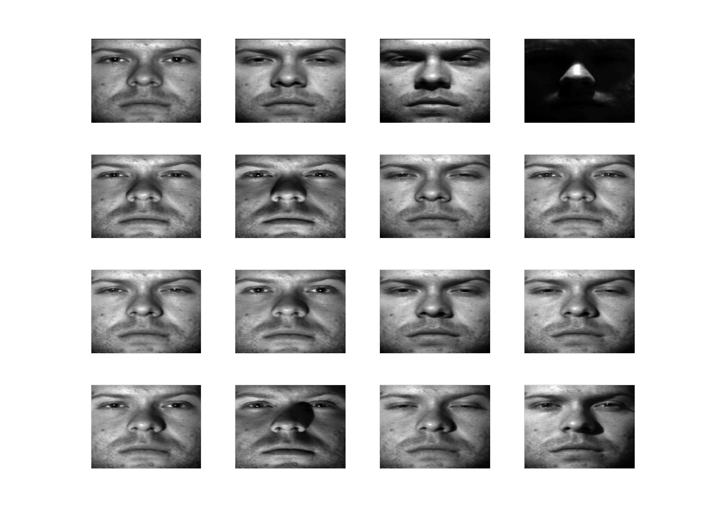
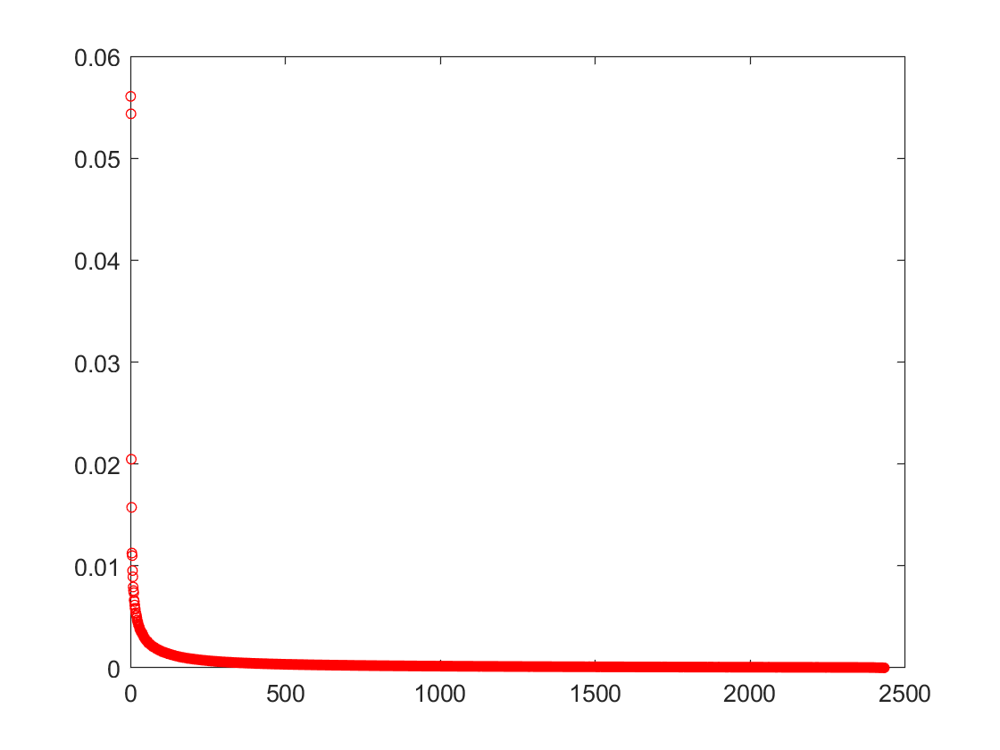
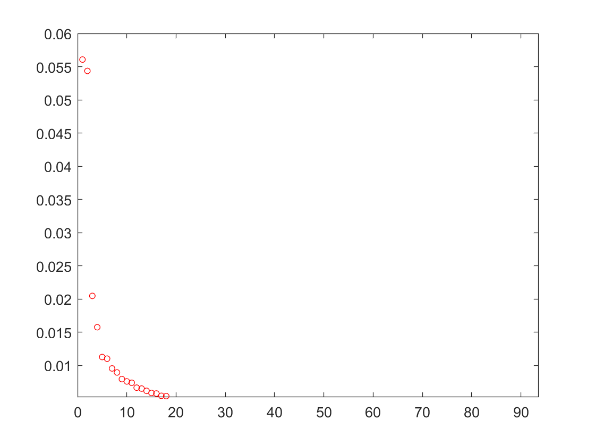
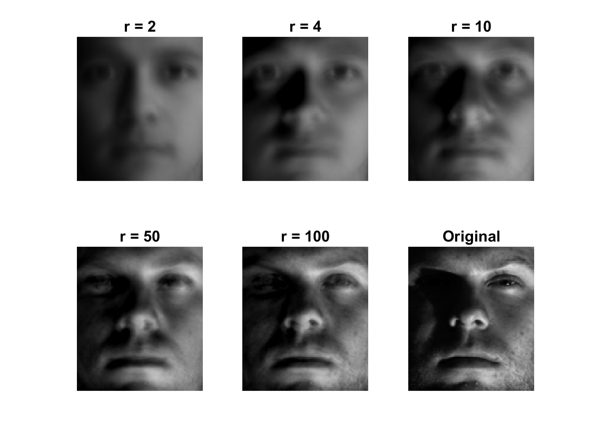
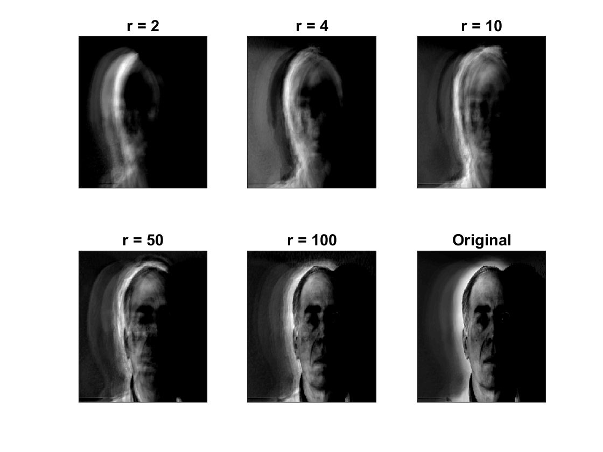

# Homework 1: Extended Yale Faces B Database – Eigenfaces

AMATH 482/582 Winter Quarter 2018

Chongyi Xu, chongyix@uw.edu

## **Abstract**

This homework tends to focus on performing Singular Value Decomposition (SVD) analysis of the given face data set. Our goal is to constract an eigenface which could give a good result of human face recognition by computer vision.

## **Section I.** Introduction and Overview

It has been a task for many computer scientists since last century that how could we train computer to recognize different faces. We, as human, know to distinguish a peroson to another person since childhood. But how could we let computers to learn to do that? Computers are not like human, they read the images pixel by pixel and store the color in evey single pixel as a string of data. And what we are going to do is to train computers using our data such that they could build an eigenface (average face) and recognize different people by comparing the difference between the testing face and the eigenface.


## **Section II.** Theoretical Background
Singular Value Decomposition (SVD) performs a decomposition of *any* matrix to the form as the following 

$$A = U\Sigma V^*$$

where $A$ is the matrix we are working with, $\Sigma$ is a diagonal matrix and $V^*$ is a unitary matrix. In general, this decomposition can be interpreted as rotations and rescalings for a base matrix. $\Sigma$, as a diagonal matrix with singular values, is ordered from biggest to smallest (top-left to bottom-right), telling the importance of principal directions. Columns of matrix $U$ is the principal directions. And $V^*$ tells that for the data, how each piece of the data projects on the direction. 

Considering the eigenfaces situation, $U$ tells the dominant average faces. $\Sigma$ indicates the features to identify different individuals and $V^*$ shows how each image/modes projects on the eigenfaces.

And in this homework, we are also trying to find the correlation matrix $C$, which can be computed by $C = A A^*$. This matrix tells that how much is each column depended on other columns. With calculating $C$, we are able to remove some "noisy" data and also redundancy.

## **Section III.** Algorithm Implementation and Development

In this section, I will explain my algorithm and *MATLAB* code.

### 1. Read in data (faces)

I started with cropped images first.

```MATLAB
%% Import Data-------------------------------------------------------------
%% cropped images
path = 'data\CroppedYale';
Files_in_main = dir(path);
Files_in_sub = dir([path, '\', Files_in_main(3).name]);
index = 1;
% The "real" folder starts with index of 3
for i = 3:length(Files_in_main)
    subpath = [path, '\', Files_in_main(i).name];
    Files_in_sub = dir(subpath);
    for j = 3:length(Files_in_sub)
        img_src = [subpath, '\', Files_in_sub(j).name];
        img = imread(img_src);
        img = double(img);
        s = size(img);
        data_cropped(:, index) = reshape(img, s(1) * s(2), 1);
        index = index + 1;
    end
end
```

I used an outer for loop to get in every subdirectory inside of ```data\CroppedYale``` folder. And an inner for loop to find every image. In order to store the image data inside a single matrices for further computation, I reshape the matrix to column vectors and store in one matrices called ```images```.

To get a breif understanding of the given images data, I picked first 16 images to compare.

```Matlab
if index <= 16
    subplot(4, 4, index), pcolor(flipud(img)), shading interp, colormap(gray), set(gca, 'Xtick',[],'Ytick',[])
end
``` 

And the plot I got is the following



We can see that those are the same face but just some differences on modes.

Similarly, I imported the uncropped images.

```Matlab
%% uncropped images
path = 'data\yalefaces';
Files = dir(path);
for i = 3:length(Files)
    img_src = [path, '\', Files(i).name];
    img = imread(img_src);
    img = double(img);
    s = size(img);
    data_uncropped(:, i) = reshape(img, s(1) * s(2), 1);
end
```

### Perform SVD
Then I performed the SVD to both of my data.

```Matlab
%% svd analysis------------------------------------------------------------
% substract mean
data_cropped = bsxfun(@minus, data_cropped, mean(data_cropped, 2));
data_uncropped = bsxfun(@minus, data_uncropped, mean(data_uncropped, 2));
% SVD
[u_cropped, s_cropped, v_cropped] = svd(data_cropped, 'econ');
[u_uncropped, s_uncropped, v_uncropped] = svd(data_uncropped, 'econ');
```

## **Section IV.** Computational Results

After the SVD process, I got $u_{cropped}$ with a $32256*2432$ matrix and $s_{cropped}$, $v_{cropped}$ with size $2432*2432$. As for the uncropped images, I got $u_{uncropped}$ with size of $77760*167$ and $s_{uncropped}$, $v_{uncropped}$ with size of $167*167$.

In order to find out the eignface, I focued on the diagonal matrix $S$. Consider the cropped images first.

```Matlab
figure(2), plot(diag(s_cropped)/sum(diag(s_cropped)), 'ro', 'MarkerSize', 4);
``` 

And the plot I got is like the following



we can see that the first two singular values should play more important roles in constructing eigenfaces. And after zoom in,



it can be seen that in fact, the first two are the "more" important ones, and the rest of first 50 has some importance.

To prove the conclusion, I reconstruct at $r={2, 4, 20, 100, 500}$

First, I wrote a function to help reconstruct the image

```Matlab
function img = recons(rank, data, u, s, v, siz, num)
    mean_value = mean(data, 2);
    r = u(:, 1:rank) * s(1:rank, 1:rank) * v(:, 1:rank).';
    r = r + mean_value;
    img = r(:, num);
    img = reshape(uint8(img), siz(1), siz(2));
end
```
Then I first tried using cropped image

```Matlab
%% Reconstruction----------------------------------------------------------
number = 50; % choose of image

% cropped images
r2 = recons(2, data_cropped, u_cropped, s_cropped, v_cropped, size_cropped, number);
r4 = recons(4, data_cropped, u_cropped, s_cropped, v_cropped, size_cropped, number);
r10 = recons(10, data_cropped, u_cropped, s_cropped, v_cropped, size_cropped, number);
r50 = recons(50, data_cropped, u_cropped, s_cropped, v_cropped, size_cropped, number);
r100 = recons(100, data_cropped, u_cropped, s_cropped, v_cropped, size_cropped, number);

% plot
figure(3);
subplot(2, 3, 1), imshow(r2), title('r = 2');
subplot(2, 3, 2), imshow(r4), title('r = 4');
subplot(2, 3, 3), imshow(r10), title('r = 10');
subplot(2, 3, 4), imshow(r50), title('r = 50');
subplot(2, 3, 5), imshow(r100), title('r = 100');
subplot(2, 3, 6), imshow(reshape(uint8(data_cropped(:, number)), ...
    size_cropped(1), size_cropped(2))), title('Original');
```

And the plot I got is



It can be seen that after 50 modes, the reconstruction is good enough. It does not improve too much for $r > 50$.


### Comparison between cropped versus uncropped

Simiarly, I reconstruct images using uncropped data.

```Matlab
% uncropped images
r2 = recons(2, data_uncropped, u_uncropped, s_uncropped, v_uncropped, size_uncropped, number);
r4 = recons(4, data_uncropped, u_uncropped, s_uncropped, v_uncropped, size_uncropped, number);
r10 = recons(10, data_uncropped, u_uncropped, s_uncropped, v_uncropped, size_uncropped, number);
r50 = recons(50, data_uncropped, u_uncropped, s_uncropped, v_uncropped, size_uncropped, number);
r100 = recons(100, data_uncropped, u_uncropped, s_uncropped, v_uncropped, size_uncropped, number);

% plot
figure(4);
subplot(2, 3, 1), imagesc(r2), title('r = 2'), colormap(gray);
set(gca, 'Xtick', [], 'Ytick', []);
subplot(2, 3, 2), imagesc(r4), title('r = 4'), colormap(gray);
set(gca, 'Xtick', [], 'Ytick', []);
subplot(2, 3, 3), imagesc(r10), title('r = 10'), colormap(gray);
set(gca, 'Xtick', [], 'Ytick', []);
subplot(2, 3, 4), imagesc(r50), title('r = 50'), colormap(gray);
set(gca, 'Xtick', [], 'Ytick', []);
subplot(2, 3, 5), imagesc(r100), title('r = 100'), colormap(gray);
set(gca, 'Xtick', [], 'Ytick', []);
subplot(2, 3, 6), imagesc(reshape(uint8(data_uncropped(:, number)), ...
    size_uncropped(1), size_uncropped(2))), title('Original'), colormap(gray);
set(gca, 'Xtick', [], 'Ytick', []);
```

And the plot I got is 



By comparing the results, it can be concluded that for low ranks, cropped images have better performances rather than uncropped images.

## **Section V.** Summary and Conclusions

From the previous work, we could make our conclusion that cropped images could build a better eigenface and could be eaiser to recognize different human faces. Cropped images are more efficient and costless.

## **Appendix** MATLAB Code
```Matlab
%% Import Data-------------------------------------------------------------
%% uncropped images
path = 'data\yalefaces';
Files = dir(path);
for i = 3:length(Files)
    img_src = [path, '\', Files(i).name];
    img = imread(img_src);
    img = double(img);
    size_uncropped = size(img);
    data_uncropped(:, i) = reshape(img, size_uncropped(1) * size_uncropped(2), 1);
end

%% cropped images
path = 'data\CroppedYale';
Files_in_main = dir(path);
Files_in_sub = dir([path, '\', Files_in_main(3).name]);
index = 1;
% The "real" folder starts with index of 3
for i = 3:length(Files_in_main)
    subpath = [path, '\', Files_in_main(i).name];
    Files_in_sub = dir(subpath);
    for j = 3:length(Files_in_sub)
        img_src = [subpath, '\', Files_in_sub(j).name];
        img = imread(img_src);
        img = double(img);
        size_cropped = size(img);
        data_cropped(:, index) = reshape(img, size_cropped(1) * size_cropped(2), 1);
        index = index + 1;
    end
end

%% svd analysis------------------------------------------------------------
% substract mean
data_cropped = bsxfun(@minus, data_cropped, mean(data_cropped, 2));
data_uncropped = bsxfun(@minus, data_uncropped, mean(data_uncropped, 2));
% SVD
[u_cropped, s_cropped, v_cropped] = svd(data_cropped, 'econ');
[u_uncropped, s_uncropped, v_uncropped] = svd(data_uncropped, 'econ');

%% Diagonalstic------------------------------------------------------------
figure(2), plot(diag(s_cropped)/sum(diag(s_cropped)), 'ro', 'MarkerSize', 4)

%% Reconstruction----------------------------------------------------------
number = 50; % choose of image
% cropped images
r2 = recons(2, data_cropped, u_cropped, s_cropped, v_cropped, size_cropped, number);
r4 = recons(4, data_cropped, u_cropped, s_cropped, v_cropped, size_cropped, number);
r10 = recons(10, data_cropped, u_cropped, s_cropped, v_cropped, size_cropped, number);
r50 = recons(50, data_cropped, u_cropped, s_cropped, v_cropped, size_cropped, number);
r100 = recons(100, data_cropped, u_cropped, s_cropped, v_cropped, size_cropped, number);

% plot
figure(3);
subplot(2, 3, 1), imshow(r2), title('r = 2');
subplot(2, 3, 2), imshow(r4), title('r = 4');
subplot(2, 3, 3), imshow(r10), title('r = 10');
subplot(2, 3, 4), imshow(r50), title('r = 50');
subplot(2, 3, 5), imshow(r100), title('r = 100');
subplot(2, 3, 6), imshow(reshape(uint8(data_cropped(:, number)), ...
    size_cropped(1), size_cropped(2))), title('Original');

% uncropped images
r2 = recons(2, data_uncropped, u_uncropped, s_uncropped, v_uncropped, size_uncropped, number);
r4 = recons(4, data_uncropped, u_uncropped, s_uncropped, v_uncropped, size_uncropped, number);
r10 = recons(10, data_uncropped, u_uncropped, s_uncropped, v_uncropped, size_uncropped, number);
r50 = recons(50, data_uncropped, u_uncropped, s_uncropped, v_uncropped, size_uncropped, number);
r100 = recons(100, data_uncropped, u_uncropped, s_uncropped, v_uncropped, size_uncropped, number);

% plot
figure(4);
subplot(2, 3, 1), imagesc(r2), title('r = 2'), colormap(gray);
set(gca, 'Xtick', [], 'Ytick', []);
subplot(2, 3, 2), imagesc(r4), title('r = 4'), colormap(gray);
set(gca, 'Xtick', [], 'Ytick', []);
subplot(2, 3, 3), imagesc(r10), title('r = 10'), colormap(gray);
set(gca, 'Xtick', [], 'Ytick', []);
subplot(2, 3, 4), imagesc(r50), title('r = 50'), colormap(gray);
set(gca, 'Xtick', [], 'Ytick', []);
subplot(2, 3, 5), imagesc(r100), title('r = 100'), colormap(gray);
set(gca, 'Xtick', [], 'Ytick', []);
subplot(2, 3, 6), imagesc(reshape(uint8(data_uncropped(:, number)), ...
    size_uncropped(1), size_uncropped(2))), title('Original'), colormap(gray);
set(gca, 'Xtick', [], 'Ytick', []);

function img = recons(rank, data, u, s, v, siz, num)
    mean_value = mean(data, 2);
    r = u(:, 1:rank) * s(1:rank, 1:rank) * v(:, 1:rank).';
    r = r + mean_value;
    img = r(:, num);
    img = reshape(uint8(img), siz(1), siz(2));
end
```

<style>
    body {
    font-family: Helvetica, arial, sans-serif;
    font-size: 18px;
    line-height: 1.6;
    padding-top: 10px;
    padding-bottom: 10px;
    padding: 30px;
    }
</style>